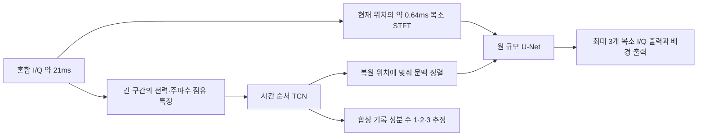

# 긴 시간 문맥을 연결한 현재 복원 모델

현재 모델은 짧은 복소 I/Q를 정밀하게 복원하는 U-Net과 긴 시간 흐름을 읽는 TCN을 결합한다. 아래 수치는 RFUAV 100MS/s 입력 기준이며 구현된 설정을 설명한다.

| 경로 | 입력과 시간 범위 | 역할 |
|---|---|---|
| 세밀한 복원 | 63,872 복소 표본, 0.63872ms, 복소 STFT | 진폭·위상을 포함한 짧은 파형 복원 |
| 긴 문맥 | 2,097,152 복소 표본에서 만든 특징, 20.97152ms | 전력·주파수 점유의 시간 변화 제공 |

긴 구간은 짧은 구간의 약 32.83배다. 긴 문맥에서 64개 주파수 구간의 상대 전력과 전체 전력 변화를 추출해 65×256 특징으로 만든다. 각 시간 토큰은 8,192표본, 즉 81.92μs에 해당한다. 이 경로에서는 복소 위상을 보존하지 않는다. 짧은 복원 경로는 복소 STFT를 사용한다.

TCN은 폭 128의 잔차 블록 6개이며 dilation은 1·2·4·8·16·32다. 각 블록의 두 kernel-3 convolution을 고려한 명목 수용영역은 253개 토큰으로 약 20.73ms다. 경계에서는 padding의 영향을 받으므로 모든 위치가 21ms의 실제 관측 표본을 동일하게 이용하는 것은 아니다. 인코딩한 문맥은 현재 짧은 창의 시간 위치에 정렬한 뒤 U-Net bottleneck에 전달된다.

따라서 반복 송신, 버스트 사이 간격, 주파수 점유 변화 등을 활용할 수 있는 정보를 제공한 구조다. 호핑 패턴이나 프로토콜을 이미 해독했다는 뜻은 아니다. 약 21ms보다 긴 주기, 특징 평균화 과정에서 소실된 세부 패턴, 긴 구간의 복소 위상까지 직접 학습했다는 주장은 하지 않는다. 현재는 미래 구간도 사용할 수 있는 비인과적 오프라인 모델이다.

## 효과를 확인하는 비교

두 모델 모두 32,142,859개 파라미터, 같은 초기화·입력 사례·업데이트 예산을 사용한다.

- **시간 순서 모델:** 256개 시간 토큰의 변화 정보를 유지한다.
- **시간 평균 대조:** 입력 특징을 시간 평균한 뒤 같은 TCN과 U-Net에 전달한다.

이 비교는 시간 변화와 복원 위치별 문맥의 효과를 함께 본다. 주기성 하나만의 인과 효과를 분리한 검사는 아니다. Transformer·LSTM 경로도 코드 후보는 있지만 현재 본 학습 비교는 TCN이다.

구현 근거: [context_model.py](../src/drone_rf/context_model.py), [context_data.py](../src/drone_rf/context_data.py). 실제 실행은 봉인된 소스 복사본을 사용하며, 새 같은 대역 실험도 같은 구조를 유지한다. [실행 규약](SAME_BAND_EXECUTION_KO.md).
