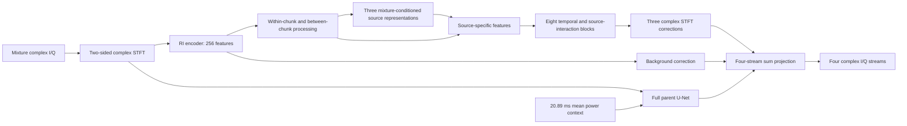

# SepTDA-inspired complex RF separation

This candidate retains the complete 32,142,859-parameter U-Net and adds a
22,453,248-parameter separator: **54,596,107 parameters total**. It adapts the
information flow of [SepTDA](https://arxiv.org/html/2401.12473v1); it is not a
faithful reproduction of its audio encoder, decoder, source-count inference,
loss, training data, or reported performance.

The branch operates on all 500 STFT frames of the original 63,872-sample fine
window. At native 100 MS/s, each STFT hop is 1.28 microseconds and a 96-frame
chunk spans 122.88 microseconds in frame-spacing units. It does not extend the
phase-preserving input to the full 20.89 ms long context. All frequency bins
enter the learned encoder; the 256-dimensional embedding is a compression,
not a lossless representation.

The full branch uses width 128, bidirectional LSTM hidden 256 per direction,
four attention heads, two attractor layers and eight triple-path blocks. The
three queries are learned parameters conditioned on the input, not aircraft
labels supplied at inference. All three signals have learned complex estimates;
none is assigned only the remainder after subtracting two predictions.

The four corrections are centered across output streams, preserving the sum of
the parent's outputs. Zero readout initialization preserves the parent's exact
initial function. The first gradient updates the readout; internal gradients
start after it becomes nonzero. This behavior was explicitly checked.

The existing count head is retained and is independent of the new branch. The
original paper's termination query/existence classifier is **not implemented**
in this first waveform comparison. There are always three signal slots plus
background, with whole-window PIT and inactive-source supervision.

Full-size CPU checks on native TRAIN count 1/2/3 mixtures passed, with zero
optimizer updates. They establish numerical/gradient connectivity, not better
separation. GPU training starts only after the ordered-context study finishes
and passes its audit. A full-size GPU backward check precedes training. Source
snapshots and hashes are pinned before optimization.

[Protocol](../../reports/2026-10-10/SEPTDA_RF_PLAN_KO.md) ·
[CPU checks](../../reports/2026-10-10/SEPTDA_RF_CPU_CHECK.json)
