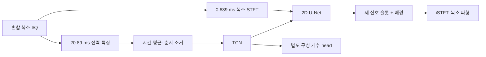

# 드론 I/Q 분리 목적과 현재 구조의 적합성 점검

2026-10-09. 논문 본문, 공개 구현, 현재 실행 코드를 대조했다. **U-Net 계열의 선택은 타당한 기준선이지만, 현재 선택 모델이 긴 RF 시간 구조까지 활용한다고 설명할 수는 없다. WaveNet이 반드시 더 좋았다는 증거도 아직 없다.** 이번 점검은 그 둘을 구분하고 실제 비교를 준비한다.

## 1. 의도와 실제 구현

목표는 한 데이터셋·같은 RF 대역의 혼합 I/Q에서 최대 세 개의 기록 기여 파형을 복원하는 것이다. 정답은 학습·평가에 사용하며 추론 입력에는 없다. 물리 드론 대수와 개별 기록 기여 성분 수를 같은 것으로 취급하지 않는다.

| 요구 | 현재 선택 모델의 구현 | 판단 |
|---|---|---|
| 진폭과 위상을 포함한 파형 복원 | 복소 STFT의 실수·허수 등을 입력으로 사용하고, 복소 출력 후 iSTFT | 목적에 부합. 위상 정보를 입력에서 버리는 magnitude-only 모델이 아님 |
| 두세 신호의 순서 무관 분리 | 세 복소 신호 슬롯 + 배경 슬롯, 전체 짧은 창에 한 번 적용하는 PIT | 목적에 부합. 기종을 출력 번호에 고정하지 않음 |
| 수 ms의 반복·호핑 순서 활용 | 약20.89ms에서 만든 특징을 **시간 평균한 뒤** TCN에 입력 | 순서를 소거하므로 현재 선택 모델이 이 요구를 충족한다고 주장할 수 없음 |
| 신호 개수 추정 | 별도 1/2/3 분류 head, 파형 출력을 hard-mask하지 않음 | 구현은 있으나 개수 정확도와 물리 대수 해석은 미해결 |
| 새 원기록·새 기종 일반화 | 개발 검증은 기록/VTSBW 변화가 함께 존재; 확인용 기종 봉인 유지 | 모델 구조만으로 보장되지 않음 |

시간 평균은 이전 동일 규모 대조에서 선택된 결과이므로, 단순히 실수로 켜진 옵션이라고 해석하지 않는다. 그러나 그 선택 결과를 긴 시간 순서를 활용했다는 성과로 설명하는 것은 맞지 않는다. 시간 순서를 보존했던 TCN 군의 실패 역시 모든 시간 구조 모델의 실패를 뜻하지 않는다.

## 2. CPU에서 실제로 확인한 사항

[실행 코드](../../experiments/architecture_audit_20261009/audit.py), [수치·소스 해시](ARCHITECTURE_CPU_AUDIT.json). 합성 입력만 사용했고 원자료·보류 기종은 읽지 않았다.

- 255개 문맥 토큰의 시간 순서를 섞어도 평균 문맥 인코더 출력의 최대 차이는 **0**이었다. 같은 인코더에 순서를 유지해 넣은 대조는 RMS 차이 **0.73695**였다. 앞 수치는 순서 소거 검산이고, 뒤 수치는 성능 개선 증거가 아니다.
- 63,872표본 복소 I/Q의 STFT→iSTFT 왕복 NMSE는 **1.09×10⁻¹⁴**였다. STFT 사용 자체가 관찰된 큰 잔차의 원인이라는 결론은 성립하지 않는다.
- 현 U-Net은 **32,142,859 파라미터**다. 준비된 RF Challenge형 WaveNet은 **4,601,867 파라미터**, 30층·128채널의 논문 기본 규모다. 후자의 파라미터가 적다는 이유로 축소 시험 모델이라고 부르지 않으며, 파라미터 수가 통제된 비교라고도 부르지 않는다.
- 현재 500프레임 입력에서 U-Net의 **정규화·문맥을 제외한 STFT 합성곱 경로**의 최대 의존 범위는 236프레임, 입력 I/Q 환산 약 **0.306ms**다. GroupNorm은 공간 전체 통계를 사용하고 RMS와 문맥도 전역 정보를 주므로, 이것을 전체 네트워크의 엄밀한 최대 수용영역이라고 설명하지 않는다. 직접 I/Q 입력 창은 **0.63872ms**다.
- 기본 WaveNet의 합성곱 경로는 `1 + 2×3×(1+2+…+512) = 6139`표본, RFUAV 100MS/s에서 **0.06139ms**다. 이름만 WaveNet으로 바꾸면 수 ms 반복을 본다는 주장은 틀리다. 이 모델도 평균 전력 문맥을 별도로 받는다.
- 실수·허수를 채널로 처리하는 현재 실수 가중치 U-Net은 정확한 위상 회전 등변성을 강제하지 않는다. 네 위상 추론 평균의 일부 개선은 관련 단서이나, 위상 처리만이 잔차의 원인이라는 결론은 아니다.
- 역사적 WaveNet 어댑터는 256토큰을 요구해 현재 native 255토큰을 거부했다. [별도 어댑터](../../experiments/architecture_audit_20261009/native_wavenet.py)로 실제 토큰 길이에 맞춰 좌표를 검사하도록 고쳤다. 원 실행 파일은 변경하지 않았다. 기존 입력에서 순전파가 bitwise 동일하고 native 입력의 checkpoint 역전파·혼합 합·정답 없는 추론 검사를 통과했다.

추가로 학습 자료에서 기종마다 clip_id 순 첫4개, 총20개 구간·8개 기록 묶음을 고정해 native 복소 자기상관과 전력 포락선 자기상관을 측정했다. 17구간에서0.4ms 이상·상관0.2 이상·prominence0.1 이상의 포락선 피크 후보가 나왔다. AVATA2의 약2.50ms 및 배수, 일부 다른 기록의 약4/5/6/10ms 후보가 보인다. 복소 자기상관의 첫0.1 하향 교차는2–44표본이었다. **짧은 파형 상관과 긴 전력 반복은 서로 다른 단서**다. 첫 교차를 충분한 모델 수용영역으로 쓰거나, 긴 피크를 FHSS 주기로 확정하지 않는다. 필터 영향·짧은 관측 시간·동일 기록 구간의 상관이 남아 있다. [학습 자료 시간 구조 수치](NATIVE_TRAIN_TIME_STRUCTURE.json).

지연 복소 상관 피크의 후속 탐색에서는 FPV/Mini3의 약50000표본(0.5ms), Mavic3 Pro의 약42813표본(0.428ms) 후보도 관찰했다. 이 사실은 첫 하향 교차만으로 수용영역을 정하면 안 됨을 보여준다. **30층·128채널 WaveNet의 dilation cycle10→15** 대조를 같은4혼합·같은32업데이트로 추가 등록했다. 초기 모든 파라미터 tensor는 동일하며 파라미터 수·손실·입력·자료가 같다. 이론적 합성곱 범위는131069표본, 양쪽 반경65534표본으로 현재63872표본 창 전체에 접근할 수 있다. 실제 관측 길이는 여전히0.63872ms이고20ms 복소 파형 문맥을 확보한 것은 아니다. [실행기](../../experiments/architecture_audit_20261009/cycle15.py), 실행 위치 `local/architecture_fit_cycle15_20261009_v2`.

처음 고려한cycle14는 전체 폭65539지만 반경32769라서 개별 출력과50000표본 지연 관측의 직접 연결을 보장하지 않았다. GPU 실행 전 취소하고cycle15로 바꿨으며,cycle15의 첫 등록도 시간 단위 설명값을 바로잡아 다시 등록했다. 두 이전 등록은 학습0회이며 취소 사유·원 소스 snapshot을 로컬에 보존했다. 실험 성능을 보고 바꾼 선택은 아니다.

## 3. 직접 관련된 선행 구조

| 근거 | 본문에서 확인한 방법 | 우리 연구에서의 판단 |
|---|---|---|
| Lancho 외, RF Challenge, IEEE OJCOMS 2025, §III.B | I/Q 1D U-Net의 초기 커널을 RF 상관 길이에 맞추고, 30층·128채널 WaveNet도 비교 | 두 계열 모두 RF 복원 기준선으로 타당. 현재의 2D STFT U-Net과 논문의 1D 모델은 다름. 알려진 SOI와 간섭의 설정이므로 미지 DJI 세 성분의 우월성 근거가 아님. [원문](https://arxiv.org/html/2409.08839v3) |
| Tian 외, learnable-dilation WaveNet, 2024, §2 | 팽창률 조절·256채널·혼합별 dilation cycle·자료 증강 | 고정 WaveNet보다 신호 구조에 맞춰 시간 범위를 정해야 한다는 근거. 별도 증강과 학습도 바뀌므로 모든 이점을 팽창률 하나의 효과로 해석하지 않음. 테스트 자료를 validation에 썼다고 명시한 절차는 우리 봉인 평가에 적용하지 않음. [원문](https://arxiv.org/html/2402.09461v1) |
| Damara 외, Transformer U-Net, ICASSPW 2024 | 원시 파형 1D encoder–decoder의 병목에 self-attention. 깊이24·차원1024 attention, 4×A100 학습 | RF에서 U-Net+attention의 직접 사례. 매우 큰 원 구조이며 우리 8GB GPU·자료 규모와 예산을 함께 검토해야 함. 기존 U-Net에 작은 attention만 붙여 원 논문 재현이라고 부르지 않음. [원문](https://rfchallenge.mit.edu/wp-content/uploads/2024/02/OneInAMillion_ICASSP_Paper_SP_Challenge_HHI.pdf) |
| Gao 외, IQUMamba-1D, JKSUCIS 38:63, **2026-01-13** | I/Q 1D U-Net, 선택적 상태 공간 처리, token 방식 선택, skip 처리. PSK/QAM/APSK 및 공개 변조 자료에서 실험 | 최신 U-Net 후보 중 과제와 직접 관련됨. 실제 드론 OTA 분리 결과는 아니며 논문도 3개 이상 성능 저하를 밝힘. 샘플 수가 길어도 100MS/s에서의 물리적 시간은 다시 계산해야 함. [원문](https://doi.org/10.1007/s44443-025-00440-5) |
| Rodrigez 외, Learning to Separate RF Signals Under Uncertainty, ICC2026 채택 표기 | 종류별5단 U-Net 여러 개와 하나의8단 U-Net을 총 파라미터 수에 맞춰 비교 | 2026년 연구에서도 RF용 U-Net이 유효한 기반이다. 알려진 SOI+여러 후보 중 한 간섭의 종류 불확실성이며, 세 신호를 모두 출력하거나 개수를 추정한 실험은 아니다. 우리의 다중 출력·개수 보조손실 효과를 직접 증명하지 않음. [본문 §IV·표I](https://arxiv.org/html/2602.04650v1), [채택 표기](https://arxiv.org/abs/2602.04650) |
| Naseri 외, RF time–frequency U-Net, ICASSPW2024 | 복소STFT 2D U-Net을 사용하되 알려진 OFDM의64표본FFT·80표본hop·CP제거/복원에 맞춤 | 2D STFT U-Net도 RF 복원에 타당한 선행 사례다. 핵심은 알려진 심볼 구조와 표현을 맞췄다는 점이다. 우리 DJI 기록의FFT/CP/동기를 확인하지 않고64/80을 그대로 사용하면 안 된다. [원문 §2](https://rfchallenge.mit.edu/wp-content/uploads/2024/02/UNET_ICASSP2024-1.pdf) |

IQUMamba의 [공개 코드](https://github.com/wzdsqaa/IQUMamba1D/tree/8b7f1822a64ae7958aba6dfb58e51e2f3c425331)를 실제로 읽었다. 검토한 구현은 실수 `Conv1d`와 표준 `mamba_ssm.Mamba`를 사용한다. 복소 구조 제약이나 정확한 위상 회전 등변성이 구현됐다고 자동으로 가정하지 않는다. `32768` 설정의 stride는 `[1,2,4,8]`로 누적64배이고 일반4단 설정은 `[1,2,2,2]`다. 길이에 따라 실제 구조가 바뀐다. 기본 출력4실수채널은 두 복소 신호이며, 우리 세 신호+배경에는 출력8채널·PIT·원기록 분할 어댑터가 필요하다. 공식 고정 순서 SI-SNR과 우리 복소 gain 투영 SI-SDR도 같은 지표로 간주하지 않는다.

RF Challenge 공개 구현은 태그 `0.2.0`, commit `ab1d51b8846ea5e7969d466cd84d51136691a432`에서 확인했다. `src/configs/wavenet.yml`과 `src/torchwavenet.py`가 30층·128채널·cycle10 설정을 뒷받침한다. 외부 소스는 로컬 검토본으로 보존하며 학습 프로그램으로 실행하지 않았다.

## 4. 다음 구조를 고르는 기준과 실행

**우선 WaveNet 원 규모 기준선을 실험에 포함하는 것이 타당하다.** 현재 약신호 잔차가 2D 표현/풀링 때문인지, 자료·손실·식별성 때문에 생기는지 구분할 비교가 부족하다. 과거부터 학습한 STFT 모델과 새 WaveNet의 동일 epoch 숫자만으로 구조의 우열을 주장하지 않는다.

1. **현재 진행 중인 개수 기울기 차단 5 epoch와 고정 네 위상 평가를 마친다.** 구조와 별개로, 공유 인코더 보조 과제가 파형 학습을 방해했는지 직접 확인하는 이미 등록된 실험이다.
2. **원 규모 WaveNet/현재 원 규모 U-Net의 native 입력 학습 진단을 실행한다.** 양쪽 새 초기화, 같은 TRAIN의 2성분 두 개·3성분 두 개, 전체63,872표본, 같은32업데이트와 AdamW 설정이다. 입력·출력을 줄이지 않는다. 이는 작은 모델 실험이 아니라 소수 사례 적합도 진단이다. 모델 수용 능력·기울기·메모리·처리량을 확인하며 검증 성능으로 보고하지 않는다. [고정 규약·실행기](../../experiments/architecture_audit_20261009/fit_diagnostic.py). 대기 프로세스와 완료 여부는 `local/architecture_fit_20261009_v1/STATE.json`에 기록한다.
3. 진단을 통과한 비교는 같은 native 혼합과 기록 분할에서 본학습으로 확장한다. 시작 상태·실제 업데이트·파라미터 수·관측 시간을 모두 표기한다. 현 전이 모델은 실용 기준선으로 별도 남긴다. 새 모델의 5 epoch 실패를 전체 계열의 실패로 일반화하지 않는다.
4. **시간 문맥 확장은 평균을 내기 전의 정보를 보존해야 한다.** 후보는 RF용 1D U-Net의 커널/다중 해상도 조정, 시간 순서가 있는 병목 attention/SSM, 또는 긴 시간–주파수 특징과 국소 복소 복원을 연결하는 구조다. 기존 ordered-TCN·gate 실험과 다른 점을 한 번에 하나씩 정한다. 입력 자체가0.639ms이면 병목에 Transformer를 붙여도 그 밖의 파형을 볼 수 없다.

이전 원시 I/Q 1D U-Net 짧은/긴 창 시험은 새 초기화·별도 학습량이었고, 현재 선택 STFT 모델은 사전 학습 이력이 길다. 그 비교만으로 1D U-Net/WaveNet이 부적합하다는 결론을 내릴 수 없다. 게이트 추가 시험에서는 분기 자체의 영향이 작았다는 진단도 있어, 최신 모듈 이름만 바꿔 반복하는 것은 우선하지 않는다.

**실행 연결:** 세 원 규모 모델의 고정 TRAIN 적합도·유한 기울기 검사를 통과하면, WaveNet cycle10 / cycle15 / STFT U-Net을 각각 새 초기화에서 같은5epoch/375업데이트로 학습하는 [비교 실행기](../../experiments/architecture_audit_20261009/train_comparison.py)를 등록했다. 각epoch를 세 군에 번갈아 적용해 공통 예산 결과를 남긴다. native 원자료·합성 목록·검증630개·seed0·실효batch32·AdamW5e-4는 같고, 모델별 hyperparameter 탐색은 하지 않는다. 원 규모·전체 입력을 유지하며, 파라미터 수와 계산량은 다르다. 이는 예산을 제한한 탐색 비교이고 각 계열의 충분히 수렴한 최적 성능 대결은 아니다. 체크포인트는 각 군의2·3성분 평균 NMSE로 고르며 확인용 기종을 열지 않는다. `local/architecture_native_screen_20261009_v1/STATE.json`이 실제 대기/학습 상태다. 사전 진단이 실패하면 본학습을 시작하지 않고 원인을 검토한다.

**현재 판단:** 현 모델은 복소 파형 분리 기준선으로 적합하다. 긴 시간 구조를 이용하는 최종 모델로서는 보완이 필요하다. WaveNet은 빠져 있던 직접 비교군이고, IQUMamba-1D는 확인할 가치가 큰 최신 후보다. 어느 쪽이 더 잘 복원하는지는 같은 자료에서의 파형 오차와 약신호 성능으로 결정한다.

검토 절차에는 `scientific-critical-thinking`을 사용했다. 절차 출처: Kassis 외, *Scientific Agent Skills*, [arXiv:2609.00065](https://arxiv.org/abs/2609.00065). RF 성능의 근거 문헌으로 사용한 것은 아니다.
