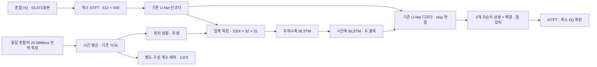

# 현재 시험하는 복소 I/Q 분리 구조

현재 후보는 **기존 복소 STFT U-Net의 압축 특징에 주파수축·시간축 양방향 LSTM을 넣은 지도 분리기**다. NMF를 포함하지 않는다. 입력은 혼합 I/Q이며 원파형 정답은 학습 손실과 사후 평가에만 사용한다.

혼합에서만 구한 크기 척도로 STFT를 정규화하고 실수부·허수부·상수 채널·log1p 크기를 기존 본체에 입력한다. 원래 본체32,142,859개 파라미터를 유지하며 순환 경로5,263,616개를 추가했다. 총37,406,475개다. 각 순환 블록은256채널 표현에서 전체32개 주파수 셀을 읽고, 주파수별31개 시간 셀을 읽는다. 마지막 추가 투영을0으로 초기화했으므로 학습 전 출력은 부모와 같다.

이 구조는 국소638.72μs 창 안의 시간·주파수 정보를 결합한다. 창 밖20.8896ms의 복소 위상을 새로 보는 구조가 아니다. 긴 전력 경로는 기존 시간 평균 조건을 유지한다. 시간 평균은 긴 호핑 순서를 제거하므로 긴 호핑 활용을 입증한 결과로 표현하지 않는다.

네 복소 출력의 합이 혼합STFT와 같도록 선형 투영한 뒤 I/Q로 되돌린다. 세 성분의 출력 순서는 고정 기종 순서가 아니며 학습·평가에서PIT로 정답과 대응한다. 실제 혼합 개수·기종·정답 파형을 모델 추론에 주지 않는다. 배경 정답은 이 합성 실험에서0이고 각 원기록의 수신 잡음은 해당 성분 정답에 포함된다.

개수 head는 긴 평균 전력 문맥에 연결되어 있고 새 순환층의 국소 출력을 직접 읽지 않는다. 예측 개수로 파형을 강제로 자르지도 않는다. 따라서 파형 분리와 개수 추정을 따로 평가한다. 현재 낮은 개수 정확도를 자동 드론 대수 추정 성공으로 바꾸지 않는다.

[TF-GridNet III-A/B절](https://zqwang7.github.io/publications/TASLP2023_TF-GridNet.pdf)의 시간·주파수별 순환 처리를 참고한 적용 후보이며 원 논문 재현은 아니다. 원 논문의 추가 attention과 다중 마이크 조건을 가져온 것이 아니다. [첫 epoch와 후속 규약](TF_AXIS_CONTINUATION_PLAN_KO.md), [새 층의 실제 영향](TF_AXIS_MECHANISM_KO.md), [본체 고정 대조](TF_AXIS_ADAPTATION_PLAN_KO.md).
