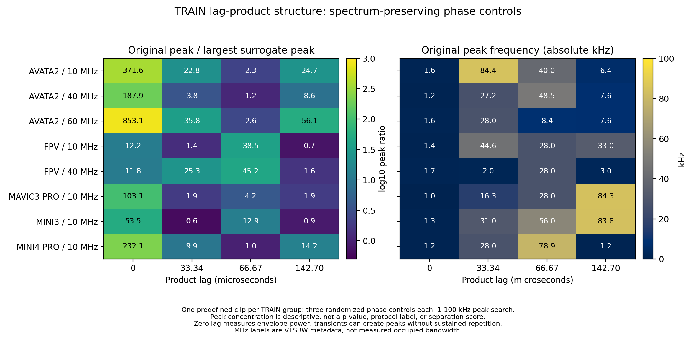

# 시간 구조: 전력 스펙트럼을 유지한 위상 무작위 대조

2026-10-10. 기존 TRAIN 8묶음에서 파일명·구간 순서상 가운데 구간 하나씩을 먼저 정했다. 20.8896ms·100MS/s의 동일 native RF 캐시를 사용했다. 새 학습·개발검증·보류 자료 접근은 없다.

## 측정

평균을 뺀 I/Q를 \(x[t]\)라 할 때 \(p_\tau[t]=x[t]x^*[t-\tau]\)를 만든다. \(\tau=0,3334,6667,14270\)표본을 사전에 고정했다. 지연 곱의 평균을 제거하고 Hann 창을 곱한 뒤, 절대 주파수 1–100kHz에서 가장 큰 FFT 빈을 찾았다. 최대 빈 에너지를 지연 곱 전체 에너지로 나눈 값이 측정값이다.

각 원 구간의 FFT 크기는 유지하고 위상만 독립적으로 무작위화한 대조 3개를 만들었다. 원 구간의 최대 빈 비율을 세 대조 중 가장 큰 비율로 나눠 아래 그림에 표시한다. 유한 구간의 원형 전력 스펙트럼 보존과 선형 지연의 경계 보존은 다르다. 전자는 상대 최대 오차 1e−12 이하로 확인했지만 후자를 정확히 보존한다고 주장하지 않는다. 알려진 4096Hz 포락선 합성 신호의 피크도 검산했다.

[그림 PDF](TRAIN_CYCLIC_CONTROLS.pdf) · [전체 원 수치](TRAIN_CYCLIC_STRUCTURE.json) · [그림 수치](TRAIN_CYCLIC_CONTROLS.json)

## 관찰과 해석

- FPV 두 기록의 66.67μs 지연 곱에서 약 28kHz 피크가 나타났고, 피크 집중도는 세 대조의 최댓값보다 각각 약 38.5·45.2배 컸다.
- Avata2 세 기록의 142.70μs 지연에서는 약 8.6–56.1배였다. 모든 지연이 똑같이 강한 것은 아니었다.
- 0지연은 전력 포락선이다. 큰 비율이 나타났지만, 1–1.7kHz 부근 피크는 일시적인 송신 구간·전력 변동으로도 생길 수 있다. 지속적인 반복 주기를 입증한 결과가 아니다.

이는 같은 평균 전력 스펙트럼만으로 설명되지 않는 시간 구조를 더 살펴볼 근거다. **비교 신호가 세 개뿐인 기술 통계**이며 p값·다중 비교 검정·기체 고유 지문·FHSS/OFDM 판별·혼합 분리 성능은 아니다. 원기록 한 묶음당 한 구간이므로 다른 구간의 재현도 별도로 확인해야 한다. 낮은 대조 비율도 특정 통신 규약의 부재를 뜻하지 않는다.

복원기가 이런 지연 관계를 유용하게 사용할 수 있는지는 아직 미검증이다. 기존 긴 복소 문맥 후보와 ordered-TCN 비교의 실패 결과도 유지한다. 입력 길이만 늘리면 해결된다는 결론을 내리지 않는다. 현재 성분 특징 규모 대조의 결과와 별도로, 후속에서 시간 순서와 지연 관계를 보존하는 특징을 검토할 수 있다.
