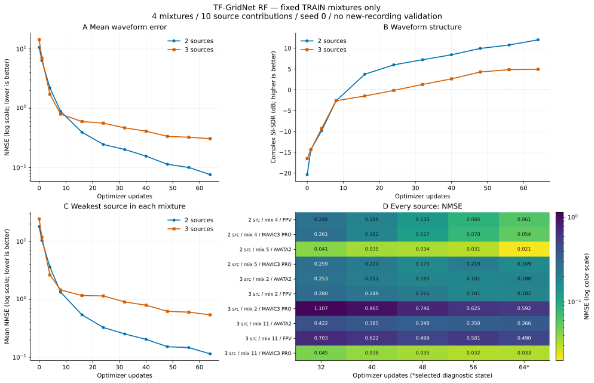

# TF-GridNet RF64: 연속 적합 진단 결과

전체 모델과32회 optimizer·RNG를 이어 총64회까지 학습했다. 원 규모9,004,297파라미터·FP32/chunk32·TRAIN4·원 손실을 유지했다. 추가 학습은 약26.6분, 첫32회 포함 약54분이며 최대64회 규약에 따라 종료했다. 선택은64회이고 기존 별도 녹음 최선을 대체하지 않는다.

|업데이트|두 성분 NMSE↓|세 성분 NMSE↓|두 성분 복소SI-SDR↑ dB|세 성분 복소SI-SDR↑ dB|두 성분 최약NMSE↓|세 성분 최약NMSE↓|
|---:|---:|---:|---:|---:|---:|---:|
|32|0.202298|0.468279|7.227|1.291|0.253461|0.904962|
|40|0.156362|0.411629|8.422|2.636|0.204209|0.793328|
|48|0.113949|0.336721|9.945|4.292|0.152753|0.622626|
|56|0.100773|0.325192|10.770|4.843|0.147184|0.603099|
|64|0.076288|0.308528|12.011|4.932|0.114885|0.541124|

40/48/56/64회의 평균 공동 기준은 모두 통과했다. 그러나 모든10성분 NMSE≤0.05는 달성하지 못했고, 최종 최대 NMSE는0.592211이다.32→48에는10성분 모두 좋아졌지만48→56에는4성분이 악화했다.56→64에도 일부 성분 오차가 증가했다. 평균 감소를 매 성분의 단조 개선으로 표현하지 않는다.

## 기존 적합 진단과 비교

같은 TRAIN4·64업데이트·실효batch4·AdamW5e-4·원 손실의 과거 새 초기화 U-Net mapping은 NMSE2/3=0.080269/0.443499, 복소SI-SDR15.694/2.850dB였다. 이번 TF-GridNet은 세 성분에서 두 지표 모두 나았지만, 두 성분 SI-SDR은 낮았다. 초기 출력층·파라미터 수·계산 시간이 달라 구조 하나의 인과 효과 또는 계열 전체 우월성을 입증하지 않는다. 대조 모델을 재학습하지 않았다.

과거 U-Net mapping256의 세 성분 NMSE0.144687보다 이번64회의0.308528이 높다. 학습량이 다른 종점이므로 이를 구조의 열등성 증거로도 쓰지 않는다. 이번 결과가 확인한 것은 다른 전체 구조도 학습4혼합에서 약신호 파형 오차를 줄일 수 있다는 점이다.

## 검산과 후속

CPU 감사는 PASS이며, optimizer64단계·32회 이후 모든6블록의 가중치 변화·모든 저장점 집계·선택/중지 판정을 확인했다. 마지막/선택 체크포인트 SHA-256은 `d0785c79ff4c650ccb86ad9a182944a423106494b6b000ba6b504f8cc93042d9`다. CPU 전체 파형 재추론을 수행한 감사는 아니며, 후속 GPU 적용 검사에서 학습4혼합 파형 지표를 다시 대조한다.

32회 모델의 배경 배정 검사를 완료했고,64회 선택 모델의 고정4혼합 밖 적용 검사를 이어간다. 새 기종·대역과 같은 기종의 다른 혼합을 분리해 해석한다. DEV·보류 I/Q는 열지 않았고, 실제 동시 수신·드론 식별·물리 드론 대수 추정 성과도 아니다.

[모든 수치](TFGRIDNET_CONTINUATION_RESULT.json), [감사](TFGRIDNET_CONTINUATION_AUDIT.json), [실행 전 규약](TFGRIDNET_CONTINUATION_PLAN_KO.md), [배정 진단](TFGRIDNET_ROUTING_RESULT_KO.md), [고정 혼합 밖 규약](TFGRIDNET_OUTSIDE_FIT_PLAN_KO.md).

## 그림

[벡터 PDF](TFGRIDNET_FIT_CURVES.pdf) · [원 수치 CSV](TFGRIDNET_FIT_CURVES.csv) · [그림 코드](../../experiments/fit_monitor_20261011/plot_fit.py). 곡선은 모든 저장점이며 로그 NMSE 축과 로그 색 척도를 표시했다. 패널D는32회 이후 모든10성분이다. 표본4개를 독립 반복으로 간주한 오차막대를 만들지 않았다. PNG 미리보기를 직접 확인했다.

실험 설계·계산 검사·그림 작성에는 experimental-design, optimize-for-gpu, matplotlib 스킬을 참고했다. 소프트웨어 참고문헌: Kassis,T., Agarwal,V., He,Y., Patel,D., Brueckner,A.M.(2026), *Scientific Agent Skills: A Library of Procedural Knowledge for Research Agents*. [arXiv:2609.00065](https://doi.org/10.48550/arXiv.2609.00065).
